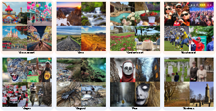
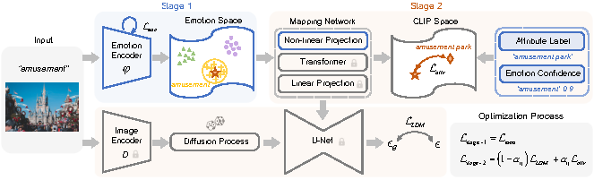
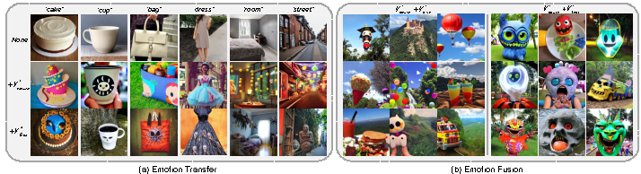
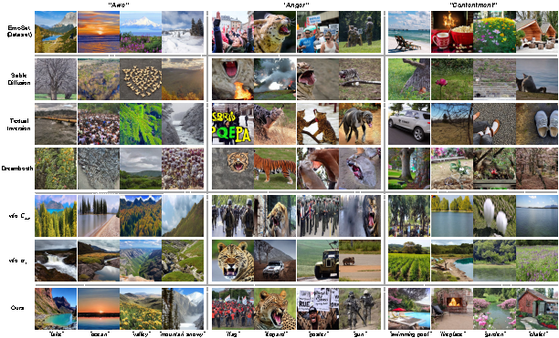

# EmoGen: Emotional Image Content Generation with Text-to-Image Diffusion Models
> [Jingyuan Yang](https://jingyuanyy.github.io/), Jiawei Feng, [Hui Huang*](https://vcc.tech/~huihuang)  
> Shenzhen University  
> Recent years have witnessed remarkable progress in image generation task, where users can create visually astonishing images with high-quality. However, exsiting text-to-image diffusion models are proficient in generating concrete concepts (dogs) but encounter challenges with more abstract ones (emotions). Several efforts have been made to modify image emotions with color and style adjustments, facing limitations in effectively conveying emotions with fixed image contents. In this work, we introduce Emotional Image Content Generation (EIGC), a new task to generate semantic-clear and emotion-faithful images given emotion categories. Specifically, we propose an emotion space and construct a mapping network to align it with powerful Contrastive Language-Image Pre-training (CLIP) space, providing a concrete interpretation of abstract emotions. Attribute loss and emotion confidence are further proposed to ensure the semantic diversity and emotion fidelity of the generated images. Our method outperforms the state-the-art text-to-image approaches both quantitatively and qualitatively, where we derive three custom metrics, i.e.,emotion accuracy, semantic clarity and semantic diversity. In addition to generation, our method can help emotion understanding and inspire emotional art design.

<a href="https://arxiv.org/abs/2401.04608"></a>

<p align="center">
  
<br>
Given an emotion category, our network produces images that exhibit unambiguous meanings (semantic-clear), reflect the intended emotion (emotion-faithful) and incorporate varied semantics (semantic-diverse).
</p>

## Description
Official implementation of our EmoGen paper.

## Pipeline
<p align="center">
  
<br>
Training process of our network. Emotion representation (stage 1) learns a well-behaved emotion space and emotion content generation (stage 2) maps this space to CLIP space, aiming to generate image contents with emotion fidelity, semantic clarity and diversity.
</p>

## Setup
To create the conda environment needed to run the code, run the following command:

```
conda env create -f environment/env.yaml
conda activate EmoGen
```

Alternatively, install the requirements from `requirements.txt`

##Usage
### Preliminary
[EmoSet](https://vcc.tech/EmoSet) is needed to train in this network, as attribute label is necessary.

We need to organize the dataset according to its attributes, and the following is its layout:

```
data_root
|
├── object
|    ├── (3) cart
|    |    ├── disgust_05770.jpg
|    |    ├── ...
|    |    └── sadness_10803.jpg
|    ├── ...
|    └── (13094) plant
|
└── scene
     ├── (1) airfield
     ├── ...
     └── (2406) street
```
The number before the attribute represents the total number of images with this attribute.
### Training
To train our network, follow these steps:

First, manually modify the code related to reading EmoSet and change the file location to the location where your EmoSet is located. For example:
In training/dataset_balance.py
```
annotion_path = f'/mnt/d/dataset/EmoSet/annotation/{emotion}/{emotion}_{number}.json' # change to "{your_EmoSet_location}/annotation/{emotion}/{emotion}_{number}.json"
```

Secondly, create training dataset:
```
python training/dataset_balance.py
```

Thirdly, start to train your own network:
```
accelerate training/main.py
```

Finally, generate emotional image:
```
python training/inference.py
```
You can modify config/config.yaml to change some details.

### Emotion Creation

<p align="center">
  
<br>
Transfering emotion representations to a series of neutral contents.
</p>

#### Emotion Transfer
To transfer emotion into object, follow these steps:
First, change training/inference.py code:
```
use_prompt = True
generate(output_dir, device, model, num_fc_layers, need_LN, need_ReLU, need_Dropout, use_prompt)
```

Then, you can choose your object:
```
templates = [
      "{} bag", "{} cup", "{} room", "{} street",
]
```

```
python training/inference.py
```

#### Emotion Fusion
to fuse different emotion together, follow these steps:

```
python training/inference_combine_emotion.py
```
this code has similar structure as training/inference.py.

## Results
#### Comparison with other diffusion models
<p align="center">
  
<br>
Qualitative comparisions with the state-of-the-art text-to-image generation approaches and ablation studies of our method.
</p>

## Citation
If you find this work useful, please kindly cite our paper:
```
@article{yang2024emogen,
  title={EmoGen: Emotional Image Content Generation with Text-to-Image Diffusion Models},
  author={Yang, Jingyuan and Feng, Jiawei and Huang, Hui},
  journal={arXiv preprint arXiv:2401.04608},
  year={2024}
}
```
